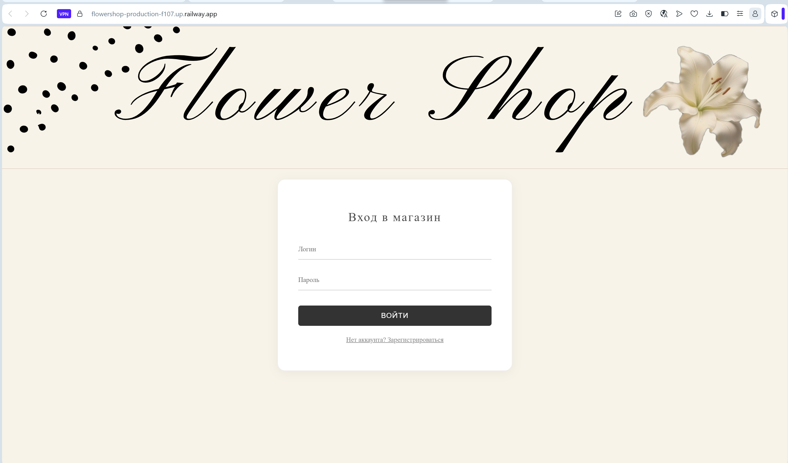

# 🌸 Flower Shop

Spring Boot Flower Shop Project is a web application for managing a flower store, developed using Spring Boot.

The project is designed to automate store operations and includes functionality for both employees and customers.

## ✨ Features

### 👩‍💼 For Employees (Admin)
- Add, edit, and delete flowers
- Manage product catalog and customer orders
- Configure product attributes (price, description, availability, etc.)
- Search flowers, bouquets, and users by parameters
- Convenient filtering

### 🛒 For Customers
- Browse flower and bouquet catalog
- Add items to shopping cart
- Place orders
- Convenient product filtering

---

## 🛠️ Tech Stack

| Category | Technologies |
| :--- | :--- |
| **Language** | Java 17 |
| **Framework** | Spring Boot 3, Spring MVC, Spring Data JPA |
| **Database** | PostgreSQL |
| **ORM** | Hibernate |
| **Testing** | JUnit 5, Mockito |
| **Build** | Maven |
| **Container** | Docker, Docker Compose |
| **Code Quality** | SonarCloud |
| **Deployment** | Railway |

---

## 🚀 Getting Started

### Prerequisites
*   Java 17+
*   Docker & Docker Compose

```bash
git clone https://github.com/MariaTukailo/flower-shop-backend.git
cd flower-shop-backend
docker-compose up
```

Application will be available at `http://localhost:8080`

---

## 📸 Screenshots



---

## 🔗 Links

- 🌐 **Live Demo:** [flowershop-production-f107.up.railway.app](https://flowershop-production-f107.up.railway.app)
- 📊 **Code Quality (SonarCloud):** [View Report](https://sonarcloud.io/project/overview?id=MariaTukailo_flower_shop)

---

## The following technologies are implemented in the project:

1. Basic REST service:
-  Create a Spring Boot application.
-  Implement a REST API for one key entity in your domain.
-  Implement:
   - GET endpoint with @RequestParam
   - GET endpoint with @PathVariable
-  Implement layers: Controller → Service → Repository.
-  Implement DTO and mapper between Entity and API response.
-  Set up the Checkstyle and adjust the code to the style.

2. JPA (Hibernate/Spring Data):
-  Connect the relational database to the project.
-  Implement at least 5 entities in the data model:
   -  at least one OneToMany connection
   - at least one ManyToMany connection
-  Implement CRUD operations.
-  Set up and justify the use of CascadeType and FetchType.
-  Demonstrate the N+1 problem and solve it via @EntityGraph or fetch join.
-  Implement a method that saves multiple related entities. Demonstrate partial saving of data without @Transactional and complete rollback of the operation with @Transactional when an error occurs.
-  Draw an ER diagram showing PK/FK and relationships.

3. Data caching:
-  Implement a complex GET query with filtering by nested entity using @Query (JPQL).
-  Implement a similar query via native query.
-  Add pagination (Pageable).
-  Implement an in-memory index based on HashMap<K, V> for previously requested data. The key must be generated from the request parameters (composite key). To ensure the correct operation of the index due to the correct implementation of equals() and hashCode().
-  Implement index invalidation when data changes.

4. Error logging/handling:
-  Implement global error handling via @ControllerAdvice.
-  Add input validation via @Valid.
-  Implement a single error format for all endpoints.
-  Set up logging via logback:
   - logging levels
   - log rotation
-  Implement an aspect (AOP) for logging the execution time of service methods.
-  Connect Swagger/OpenAPI with endpoint and DTO description.

5. Batch data processing & Testing:
- Implement a bulk operation (POST with a list of objects) that makes business sense within the framework of the project.
- Use the Stream API and Optional in the service layer.
- Ensure the transactionality of the bulk operation. Demonstrate the work with/without @Transactional and show the difference in the state of the database.
- Write:
  - unit tests for services (Mockito)

6. Concurrency:
- Implement an asynchronous business operation via @Async/CompletableFuture, which:
  - returns the task ID.
  - allows you to check the progress status
- Implement a thread-safe counter (or similar mechanism) using synchronized or Atomic.
- Demonstrate a possible race condition (50+ thread ExecutorService) and its solution.
- Perform JMeter load testing and show the results.

7. Client:
- Implement a SPA client (React/Angular/Vue, etc.).
- The client must work with the API implemented in the laboratory.
- Display the OneToMany and ManyToMany relationships.
- Implement CRUD operations and filtering.

8. Deploy:
- Prepare a Dockerfile for the application.
- Prepare Docker Compose (application + DATABASE).
- Use environment variables.
- Place the application on a free hosting (PaaS).
- Configure CI/CD in GitHub:
  - build
  - tests
  - deployment
  - healthcheck